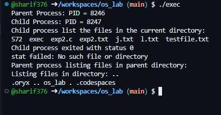

# Program Statement: 
To implement UNIX operating system calls fork, exec, getpid, exit, wait, close, stat, opendir and readdir
# Program Description
  Description of `fork`, `exec`, `getpid`, `exit`, `wait`, `close`, `stat`, `opendir`, and `readdir` System Calls

- **`fork()`**: Creates a new process by duplicating the current process, returning `0` to the child and the child’s PID to the parent.  
- **`exec()`**: Replaces the current process image with a new program. Does not return on success.  
- **`getpid()`**: Retrieves the unique process ID of the calling process.  
- **`exit()`**: Terminates a process and releases its resources, returning a status code to the parent.  
- **`wait()`**: Suspends the calling process until a child process terminates, allowing retrieval of the child's exit status.  
- **`close()`**: Closes an open file descriptor to free associated resources.  
- **`stat()`**: Retrieves file or directory metadata, including size, permissions, and timestamps.  
- **`opendir()`**: Opens a directory stream for reading its entries.  
- **`readdir()`**: Reads individual entries from a directory stream, returning their details.  

These system calls are essential for process management, file handling, and directory navigation in UNIX-like operating systems.
# Source Code:
```c
#include <stdio.h>
#include <stdlib.h>
#include <sys/types.h>
#include <sys/wait.h>
#include <sys/stat.h>
#include <unistd.h>
#include <dirent.h>
#include <fcntl.h>

void print_permissions(mode_t mode) {
    char perms[10];

    // User permissions
    perms[0] = (mode & S_IRUSR) ? 'r' : '-';
    perms[1] = (mode & S_IWUSR) ? 'w' : '-';
    perms[2] = (mode & S_IXUSR) ? 'x' : '-';

    // Group permissions
    perms[3] = (mode & S_IRGRP) ? 'r' : '-';
    perms[4] = (mode & S_IWGRP) ? 'w' : '-';
    perms[5] = (mode & S_IXGRP) ? 'x' : '-';

    // Other permissions
    perms[6] = (mode & S_IROTH) ? 'r' : '-';
    perms[7] = (mode & S_IWOTH) ? 'w' : '-';
    perms[8] = (mode & S_IXOTH) ? 'x' : '-';

    perms[9] = '\0';  // Null-terminate the string

    printf("Permissions: %s\n", perms);
}

void list_directory(const char *path) {
    DIR *dir = opendir(path);
    struct dirent *entry;
    
    if (dir == NULL) {
        perror("opendir");
        return;
    }

    printf("Listing files in directory: %s\n", path);
    while ((entry = readdir(dir)) != NULL) {
        printf("%s ", entry->d_name);
    }
    printf("\n");

    closedir(dir);
}

int main() {
    pid_t pid;
    int status;
    struct stat file_info;

    // Using fork to create a new child process
    pid = fork();
    if (pid < 0) {
        perror("fork failed");
        exit(1);
    }

    if (pid == 0) {  // Child process
        printf("Child Process: PID = %d\n", getpid());
	printf("Child process list the files in the current directory:\n");
        // Using exec to replace the process image
        execlp("/bin/ls", "ls", NULL);  // List files in the current directory
        perror("exec failed");  // If exec fails
        exit(1);
    } else {  // Parent process
        printf("Parent Process: PID = %d\n", getpid());
        
        // Wait for the child process to finish
        wait(&status);
        if (WIFEXITED(status)) {
            printf("Child process exited with status %d\n", WEXITSTATUS(status));
        }

        // Using stat to get information about a file
        if (stat("example.txt", &file_info) == 0) {
            printf("File 'example.txt' exists\n");
            print_permissions(file_info.st_mode);  // Print human-readable permissions
            printf("File size: %ld bytes\n", file_info.st_size);
        } else {
            perror("stat failed");
        }

        // Using opendir and readdir to list files in a directory
	printf("Parent process listing files in parent directory:\n");
        list_directory("..");

        // Demonstrating file operations with open, write, and close
        int fd = open("testfile.txt", O_WRONLY | O_CREAT, 0644);
        if (fd == -1) {
            perror("open failed");
            exit(1);
        }
        
        write(fd, "Hello, this is a test file!\n", 26);
        close(fd);  // Closing the file

        // Exit the parent process
        exit(0);
    }
}
```
# Interpretation of the program

This C program demonstrates the use of several important system calls in a Unix-based operating system. Below is a step-by-step breakdown of the program's actions:

## 1. Creating a Child Process (`fork()`)
- The program starts by creating a **child process** using `fork()`.
- **`fork()`** splits the program into two processes: the **parent process** and the **child process**.

## 2. Child Process
- In the **child process**, the program uses `execlp()` to replace the current process with a new program (`/bin/ls`), which lists the files in the current directory.
- The child process **executes the `ls` command** and shows the contents of the directory.

## 3. Parent Process
- The **parent process** waits for the child process to finish using `wait()`.
- Once the child finishes, the parent continues its work.

## 4. Getting File Information (`stat()`)
- The parent process uses the **`stat()`** function to get information about a file called `example.txt`.
- It then prints the **permissions** (like `rwxr-xr--`) and **file size** of `example.txt`.

## 5. Listing Directory Content (`opendir()` and `readdir()`)
- The parent process then lists the files in the **parent directory** (i.e., `..`) using `opendir()` and `readdir()`.
- These functions open a directory and read its contents, printing the names of the files inside.

## 6. File Operations (Create, Write, Close)
- The parent process **creates a new file** called `testfile.txt` using the **`open()`** system call. If the file doesn't exist, it is created.
- It **writes** a message into the file using the **`write()`** system call.
- Finally, it **closes** the file using `close()`.

## 7. Program Ends
- After completing all tasks, the parent process exits.

## Summary:
- The program demonstrates how to:
  - Create processes with `fork()`.
  - Execute commands using `execlp()`.
  - Fetch file information using `stat()`.
  - List files in directories with `opendir()` and `readdir()`.
  - Perform basic file operations like creating, writing, and closing files.

In short, the program shows how to interact with files and directories in a Unix-like system using system calls.
# HOW to execute Program
> Open the terminal
> 
> create a file example.txt
> 
> `touch example.txt`
> 
>  `ls > example.txt`
> 
> compile the program
> 
> `gcc filename.c -o exec-name`
> 
> run the program
> 
> `./exec-name`
> 
# Output of the code

